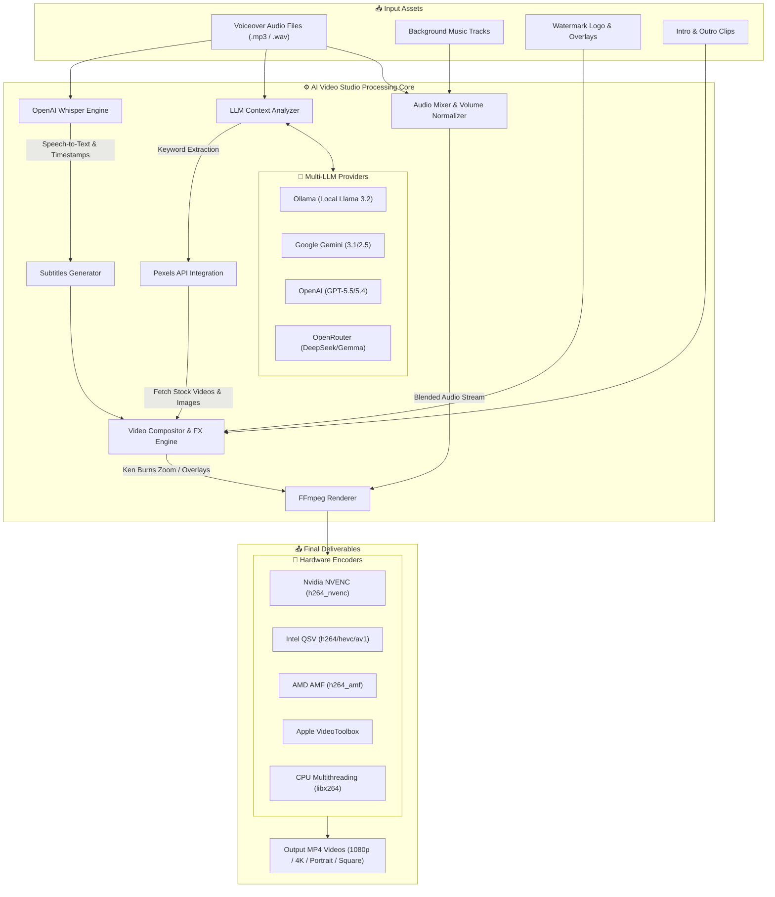

# 🎬 AI Video Studio (V21.0 Advanced)


**AI Video Studio (V21.0 Advanced)** is an all-in-one automated video generation and editing application. Powered by Artificial Intelligence (Multi-LLM APIs), OpenAI Whisper transcription, Pexels API stock media integration, and FFmpeg hardware acceleration, it turns voiceovers into high-quality, fully-edited videos with dynamic subtitles and visual effects in just a few clicks.

---

## 🔄 Application Workflow Diagram



---

## ✨ Key Features

### 🤖 Multi-LLM AI Integration
- **Local AI (Ollama)**: Full offline support for `llama3.2` and custom local models.
- **Google Gemini**: Support for `Gemini 3.1 Pro/Flash`, `Gemini 2.5 Pro/Flash`, `Gemini 2.0 Flash`.
- **OpenAI**: `GPT-5.5`, `GPT-5.4`, `GPT-5 Mini`, and flagship variants.
- **OpenRouter**: Access to `DeepSeek V4`, `Trinity`, `Gemma 4`, `Qwen3 Coder`, `Nemotron`, etc.
- **Vertex AI**: Enterprise-grade Google Cloud AI endpoints.

### 🎥 Automated Media & Video FX
- **Automatic Stock Media Retrieval**: Queries Pexels API to download contextual HD videos and images corresponding to transcribed speech keywords.
- **OpenAI Whisper Subtitles**: Automatic synchronized caption generation with customizable font, position, colors, and timing.
- **Ken Burns Effect**: Dynamic pan and zoom motion applied to static image assets.
- **Intro & Outro Concatenation**: Auto-stitching of custom intro and outro videos.
- **Logo & Watermark Overlay**: Customizable placement and opacity control.
- **Background Music Mixing**: Audio blending with voiceovers at adjustable background volume levels.
- **Disclaimer Overlay**: Support for AI-generated or custom disclaimer video/image backgrounds.

### ⚡ Hardware Acceleration Encoders
- **Nvidia NVENC** (`h264_nvenc`)
- **Intel QSV** (`h264_qsv`, `hevc_qsv`, `av1_qsv`, `vp9_qsv`, `mpeg2_qsv`)
- **AMD AMF** (`h264_amf`)
- **Apple VideoToolbox** (`h264_videotoolbox`)
- **CPU Multithreading** (`libx264`)

### 📐 Resolution & Aspect Ratio Presets
- **1080p Full HD** (1920x1080)
- **4K Ultra HD** (3840x2160)
- **720p HD** (1280x720)
- **Square** (1080x1080 - Instagram / Facebook)
- **Portrait** (1080x1920 - YouTube Shorts / TikTok / Reels)

---

## 📁 Directory Structure

```text
AI_Video_Studio/
├── mainuniversal.py              # Main Python source code (CustomTkinter GUI)
├── AI_Video_Studio_(V21.0).exe   # Standalone Windows Executable (Available in Releases)
├── Font/                         # Custom font assets (Arial, DejaVu, Nirmala, etc.)
├── ImageMagick/                  # Image processing utilities
├── Input/                        # Input voiceover audio files (.mp3, .wav, .m4a)
├── Output/                       # Final rendered output video files
├── Tempdata/                     # Temporary processing cache & media downloads
├── BackgroundMusic/              # Background music tracks
├── DisclaimerBackground/         # Disclaimer background media
├── Logo/                         # Watermark logo images
├── Intro/                        # Intro video clips
├── Outro/                        # Outro video clips
├── PexelsAPI/                    # API settings & configuration
└── README.md                     # Project documentation
```

---

## 🚀 Setup & Usage Guide

### Option 1: Standalone Executable (.exe) [Recommended]
1. Download `AI_Video_Studio_(V21.0).exe` from the [GitHub Releases Tab](https://github.com/eng-imonmahmud/AI-Video-Studio/releases).
2. Run the executable directly on Windows (No Python installation required).

### Option 2: Running from Source Code
1. Clone the repository:
   ```bash
   git clone https://github.com/eng-imonmahmud/AI-Video-Studio.git
   cd AI-Video-Studio
   ```
2. Install required Python dependencies:
   ```bash
   pip install customtkinter pillow requests openai-whisper google-genai openai urllib3
   ```
3. Run the application:
   ```bash
   python mainuniversal.py
   ```

---

## 👨‍💻 Developer Information

- **Developer**: Imon Mahmud
- **Email**: [imon.mahmud.official@hotmail.com](mailto:imon.mahmud.official@hotmail.com)
- **Version**: V21.0 Advanced
- **GitHub**: [@eng-imonmahmud](https://github.com/eng-imonmahmud)

---

## 📄 License

This project is licensed under the MIT License - see the `LICENSE` file for details.
